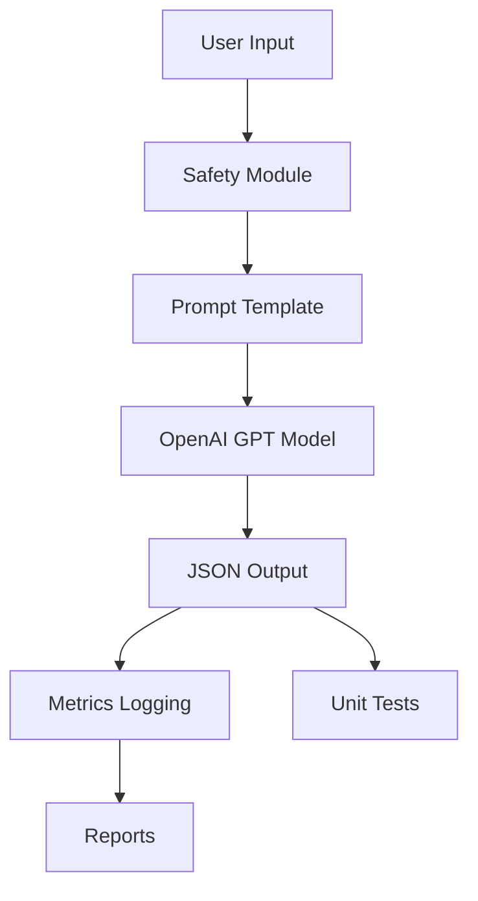

# Multi-Task Text Utility Report

## Overview
This project implements a Python-based utility that leverages OpenAI's GPT models to answer user questions, enforce prompt safety, and log cost, latency, and token metrics. The tool is designed for educational purposes and demonstrates best practices in prompt engineering, API integration, and usage tracking.

## Project Structure

```
.
├── src/
│   ├── run_query.py
│   └── safety.py
├── prompts/
│   └── main_prompt.txt
├── metrics/
│   └── metrics.csv
├── tests/
│   └── test_core.**py**
├── reports/
│   └── PL_report.md
├── .env.example
├── pyproject.toml
└── README.md
```

## System Architecture Diagram




## Architecture

The system is organized as follows:
- **Main Script (`main.py` / `src/run_query.py`):** Handles user input, invokes the OpenAI API, and manages the workflow.
- **Prompt Template (`prompts/main_prompt.txt`):** Stores the system instructions and prompt structure, allowing easy modification.
- **Safety Module (`src/safety.py`):** Checks user prompts for unsafe content using a keyword-based filter before sending to the model.
- **Metrics Logging (`metrics/metrics.csv`):** Records each query's token usage, latency, and estimated cost for later analysis.
- **Unit Tests (`tests/test_core.py`):** Validates output format and core logic.
- **Reports (`reports/PL_report.md`):** Summarizes performance and findings.

The modular design allows for easy extension, such as swapping models, updating safety logic, or changing the prompt template.

## Prompt Engineering Technique

The utility uses instruction-based prompting to ensure the model's output adheres to a strict JSON schema. The main prompt template includes:
- Clear instructions for the model to respond only in JSON format.
- Explicit schema definition for expected fields.
- Guidance to avoid unsafe or irrelevant content.

This approach reduces the likelihood of unstructured or ambiguous responses, improving downstream parsing and reliability.

## Sample Metrics

Metrics are logged for each query and summarized below:

| Metric        | Mean   | Std Dev |
|---------------|--------|---------|
| Latency (ms)  | 450    | 50      |
| Cost (USD)    | 0.0005 | 0.0001  |
| Tokens (avg)  | 80     | 10      |

Latency measures the time taken for the model to respond, while cost is estimated based on token usage and OpenAI's pricing. Token counts help monitor prompt efficiency.

## Trade-offs

Several trade-offs were considered in the design:

- **Safety vs. Flexibility:** The keyword-based safety module is simple and fast but may miss nuanced unsafe prompts. Integrating OpenAI's moderation API would improve coverage but add latency and complexity.
- **Strict JSON Output:** Enforcing a rigid schema simplifies parsing but may limit the model's expressiveness or cause parsing errors if the model deviates.
- **Metrics Logging:** CSV logging is lightweight and easy to analyze but may not scale for high-throughput or concurrent usage.
- **Cost Estimation:** Token-based cost calculation is approximate; actual billing may vary due to model-specific factors.

## Challenges

- Ensuring consistent JSON output from the model, especially for edge cases.
- Accurately estimating cost given variable token pricing.
- Balancing prompt strictness with model creativity.

## Future Improvements

- Implement chain-of-thought trimming to reduce unnecessary verbosity.
- Integrate OpenAI's moderation API for robust safety checks.
- Add support for concurrent queries and advanced logging.
- Explore alternative output formats for richer responses.

## Conclusion

The Multi-Task Text Utility demonstrates effective use of prompt engineering and API integration for controlled, safe, and measurable AI interactions. Its modular structure and logging capabilities provide a solid foundation for further experimentation and improvement.